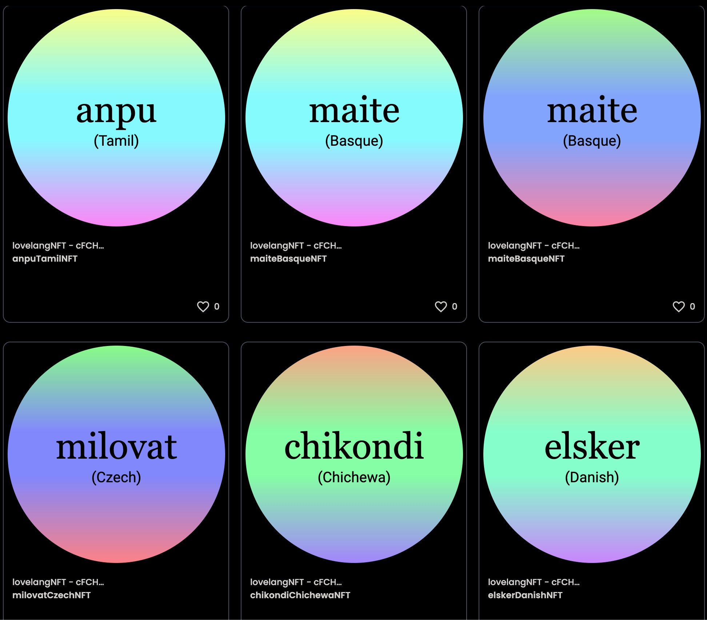

# LoveLang NFT Collection on Polygon Mumbai

### About This Project

My first NFT project. The smart contract was written in Solidity, with significant code I had never encountered, for minting ERC721 tokens. The frontend was written in React.

I chose to have as the theme of the NFTs the word love in 52 languages. The NFT is randomly generated from 2 arrays, one with the "love" and one with the corresponding language. The SVG image in the background of the NFT is also generated randomly, with each color gradient set to be 120 degrees from the previous color using HSL color coding. (see sample below)

After exploring deployment options, I modified the project so that instead of using the Rinkeby testnet, I deployed the smart contract to the Polygon Mumbai Testnet. Alchemy made the switch from Ethereum to Polygon relatively painless. The hardest part was getting testnet tokens! 😉

### What I Learned

We worked with the following "tools":
- Solidity
- Hardhat
- Alchemy
- Metamask
- React
- Opensea
- Rarible
- Polygon

The Solidity used was focused on ERC721 Non-Fungible Tokens. At first it was difficult getting my head wrapped around the interaction between the Smart Contract and the React code, but it became apparent quickly that ethers.js was providing a wide variety of functionality that allowed for the interaction. I really need to study this library more, as it (or web3.js) is essential to getting JS and Solidity smart contracts to interact. 

I also learned about Opensea and Rarible, and the roles they play in the NFT craze.

### Sample NFTs

